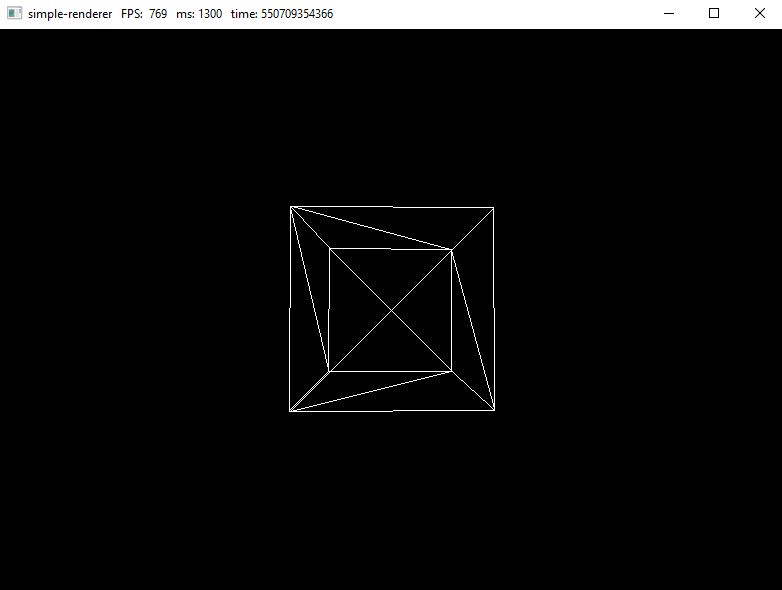

# simple-renderer

This is a program that implements the simplest algorithm for rendering to the screen using WinAPI. All the rendering logic works on the CPU side and is implemented from scratch. By default, a rotating cube is rendered on the screen.



> [!NOTE]
> This program is implemented exclusively for educational purposes (for a deeper understanding of what the 3d graphics rendering process is: translations between local, world, view and screen coordinate systems)

## Building

All source code can be compiled using CMake:

```shell
cmake -S . -B build
cmake --build build
```

In a Windows environment, it is easier to use the presets provided in the project:

```shell
cmake --preset=gcc-x64-debug
cmake --build build/gcc-x64-debug
```